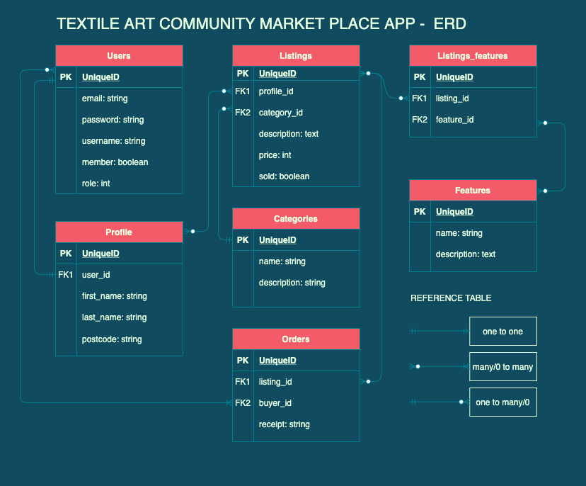

  
 
----
### Table of Contents

[The Problem](#the-problem) 
[Why solve it?](#why-solve-it) 
[Git-Hub Repo](#github-repo) 
[App Breakdown](#app-breakdown) 
[User Stories](#user-stories) 
[Wireframes](#wireframes) 
[ERD](#erd) 
[High-level Components](#high-level-components) 
[Third Party Services](#third-party-services ) 
[Project Models](#project-models) 
[Database Relations](#database-relations) 
[Database Schema Design](#database-schema-design) 
[Describe the way tasks are allocated and tracked in your project](#describe-the-way-tasks-are-allocated-and-tracked-in-your-project) 

# The Problem
Artist of the Textile Art Community Art Space - TACAS - have a monthly market in order to display their wares, sell their wares and engage with the surrounding commmunity. Since COVID-19 Lockdowns started in March 2020, TACAS has struggled to engage with their community and earn an income from their labours.
 
This is a problem that has hit many creatives from across all areas of the arts. A template marketplace app could be something many other NFP organisations could use to increase their visibility and reach online, whilst trapped at home with these incessant lockdowns.
 
 
 

# Why Solve It?
Artists brighten our day
 
Artists deserve to make a living
 
Artists deserve to be seen
 
By giving this small independent organisation an app which they can use to market their beautiful creations, we will also be giving them a way to earn some money from their creations.

# The App
The app is hosted on Heroku, and can be found via this link

# GitHub Repo

# App Breakdown
## Purpose
## Functionality/Features
## Sitemap
## Screenshots
## Target Audience
## Tech Stack
 

# User Stories
- As a <user>, I want to <action>, so/because <reason>.
- As a <user>, I want to <action>, so/because <reason>.
- As a <user>, I want to <action>, so/because <reason>.
- As a <user>, I want to <action>, so/because <reason>.
- As a <user>, I want to <action>, so/because <reason>.
- As a <user>, I want to <action>, so/because <reason>.
- As a <user>, I want to <action>, so/because <reason>.
- As a <user>, I want to <action>, so/because <reason>.
- As a <user>, I want to <action>, so/because <reason>.
- As a <user>, I want to <action>, so/because <reason>.

# Wireframes

# ERD
 

# High-level Components

# Third Party Services

# Project Models
Describe your projects models in terms of the relationships (active record associations) they have with each other

# Database Relations
Discuss the database relations to be implemented in your application

# Database Schema Design

https://dbdocs.io/?utm_source=dbdiagram&utm_medium=promo_button
https://dbdiagram.io/d

# Describe the way tasks are allocated and tracked in your project

# README

This README would normally document whatever steps are necessary to get the
application up and running.

Things you may want to cover:

* Ruby version

* System dependencies

* Configuration

* Database creation

* Database initialization

* How to run the test suite

* Services (job queues, cache servers, search engines, etc.)

* Deployment instructions

* ...
