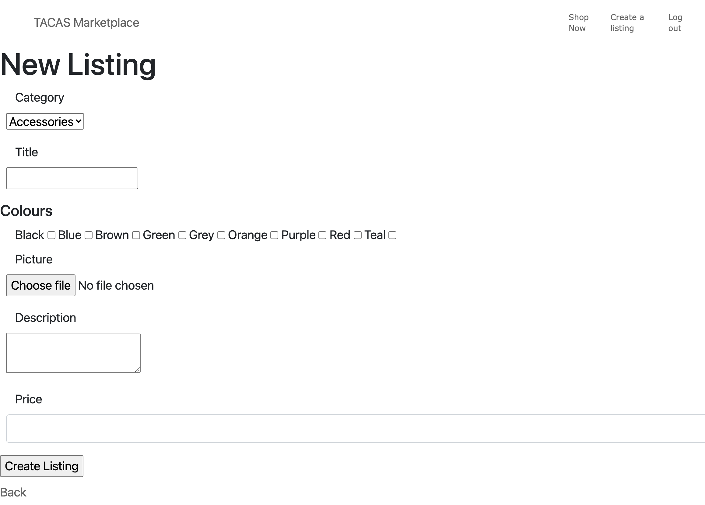
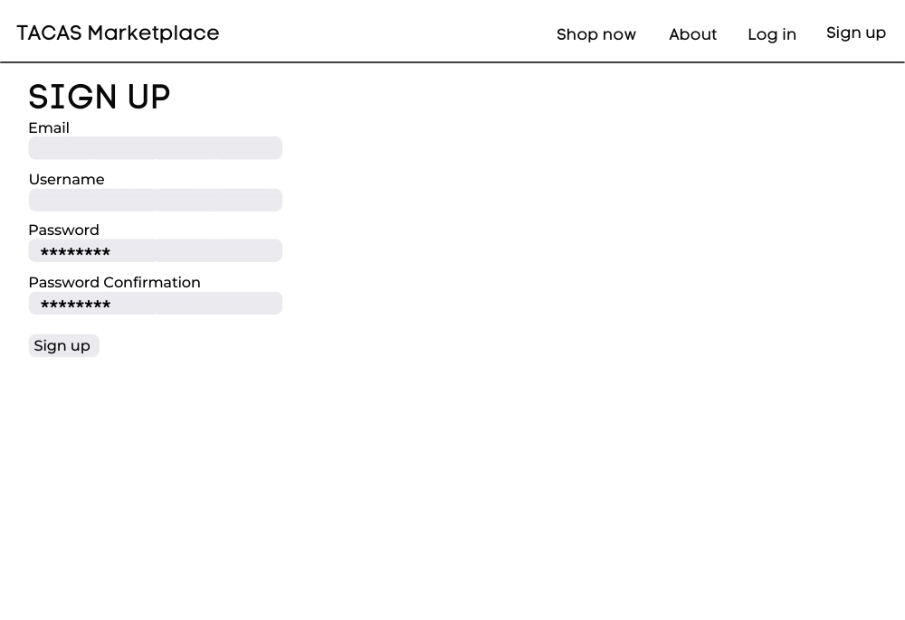

  
 
----
### Table of Contents

[The Problem](#the-problem) 
[Why solve it?](#why-solve-it) 
[Git-Hub Repo](#github-repo) 
[App Breakdown](#app-breakdown) 
[User Stories](#user-stories) 
[Wireframes](#wireframes) 
[ERD](#erd) 
[High-level Components](#high-level-components) 
[Third Party Services](#third-party-services ) 
[Project Models](#project-models) 
[Database Relations](#database-relations) 
[Database Schema Design](#database-schema-design) 
[Describe the way tasks are allocated and tracked in your project](#describe-the-way-tasks-are-allocated-and-tracked-in-your-project) 

# The Problem
Artist of the Textile Art Community Art Space - TACAS - have a monthly market in order to display their wares, sell their wares and engage with the surrounding commmunity. Since COVID-19 Lockdowns started in March 2020, TACAS has struggled to engage with their community and earn an income from their labours.
 
This is a problem that has hit many creatives from across all areas of the arts. A template marketplace app could be something many other NFP organisations could use to increase their visibility and reach online, whilst trapped at home with these incessant lockdowns.
 
 
 

# Why Solve It?
- Artists brighten our day
 
- Artists deserve to make a living
 
- Artists deserve to be seen
 
- By giving this small independent organisation an app which they can use to market their beautiful creations, we will also be giving them a way to earn some money from their creations.

# The App
TACAS Marketplace is a 2-sided marketplace app developed in Ruby on Rails. This is a simple app where TACAS members can login and upload listings for their creations; and buyers can peruse those creations from the comfort of their own home.

# URL
https://tacasmarketplaceapp.herokuapp.com/

# GitHub Repo
https://github.com/jazzicoda/tacas_marketplace_app

# App Breakdown
## Purpose
The purpose of this app is to provide an interface between the makers and artists of TACAS and people who would like to buy their beautiful creations.
## Functionality/Features

### User Login
Users need to login to access the "back end" usability of this app. For example, a user needs to be registered, and signed in to enable them to create a listing page. The user login also allows the user to edit and destroy their listings.

### Listings Index Page
The listings index page is public facing, and provides a list of all the products available for sale. This list includes the Title, Description and Price of the product. In the next iteration of this app, I will work on the styling of this page to better mirror the wireframes. Each listing will have an image above the title and price.

### Listing Pages
Each product has a Listing Page which provides more detail on the product as well as the option to buy (not yet linked to Stripe). The information listed her includes: one image (multiple images in future iterations), category, colours, description, and price.

## Sitemap
 

## Screenshots
Below are images from the live app on Heroku. As you can see, I have started styling the Home page, but there is more to don the next sprint.
### HOME PAGE

### LISTINGS INDEX PAGE

### LISTING PAGE

### SIGN UP PAGE

### LOG IN PAGE

### NEW LISTING PAGE

## Target Audience
There are 3 target audiences for this app.

TACAS Artists: The artists are the main "user" target audience for the app. It is a channel for them to sell their artworks while it is impossible to sell using their traditional face to face mathod of sales.

Local buyers: Local community members who miss attending the monthly market are looking for ways to support the local artists they have come to admire. It is also handy for the future if community members are searching for gists - they aren't constrained by the scheduled timing of a monthly market.

Interstate/International buyers: These are the discerning buyers who seek out this kind of work from online stores. Accessing this audience means that the TACAS artists can increase their revenue in the future.

## Tech Stack
Numerous programs were used in the production stage of this app. Each program helps the others to come together and make one unified app.

 
 

# User Stories
- As an artist and maker at TACAS, I want to sell my art, soI can make some money off my time and efforts.
- As an older artist, I want to use an easy to understand interface, because I don't use computers much.
- As an artist, I want to be valued within my community, because it makes me feel good.
- As an artist, I want to be able to show people beyound my immediate bubble what I have been working on, soI can build community.
- As a community member, I want to be able to support local artists, so that they are still able to survive, even in lockdown.
- As a community member, I want to be able to support local artists, because supporting local businesses is good for bith the local economy and the environment.
- As an artist, I want a safe way to sell my works, so that myfamily and community are protected from COVID.<reason>.
- As a lover of textile arts, I want to be able to admire and buy textile art from around the world, because I love to see what different artists are making. <reason>.

# Wireframes
Below is the set of wireframes I created for the project. I have made both Mobile and Desktop versions for the 7 pages of this app.

Home Page  
  

Listings Index Page  
  

Listing Page  
  

Sign Up Page  
  

Log In Page  
  

New Listing Page  
  

Listing Page (Logged In) 
  

# ERD
 

# High-level Components
- ACTION PACK: The Routes.rb handles requests and responses.
- ACTIVE MODEL: 
- ACTIVE RECORD: Naming and conventions are used to define classes in the db tables, allowing smooth ORM. These have been used between the Model, Controllers and Views creating a matrix lie connection to make code dry.
- ACTIVE SUPPORT: Built in classes and extensions to help create the "Rail Magic"! Helper methods are used throughout the project to make code more concise.

# Third Party Services
 
The following third party services have been used on this project:
- AWS S3: utilaised for active memory storage of images. When users upload their listing images, they are securely stored using S3.
- Stripe: I have started the implementation of aa Stripe payment system, however was having some issues, so have commented out all Stripe code at this stage. I have left it in situ so I can implement it in the next iteration of the app.
- Heroku: This Rails app has been deployed through Heroku.

# Project Models
There are multiple models to make this app work: 
- APPLICATION RECORD: a single point of entry for all the customisations and extensions needed for the app.
- CATEGORY: has many listings
- COLOUR: has many listings_colours through a join table with Listings.
- LISTING: belongs to User & Category; has many Listing_Colours through the join table with Colour; has one Picture attached. Change this for multi pics later.
- LISTINGS_COLOUR JOIN TABLE: Belongs to Listing & Colour
- USER: has many Listings; authenticated by Devise.

# Database Relations
The PostgreSQL database contains the following tables:
 
These tables have the following structures:
 
 
 
 
 

# Describe the way tasks are allocated and tracked in your project
A Trello board was set up to keep track of all tasts for this project. As jobs and bugs became apparent, they were added to the board, then moved to the "Complete" section as they were done. I use colour coding to keep track with the next step. No colour is everything to come, but is not yet imminent. Orange once I start working on it, then Green once it is finished. Checklists were used to keep track of sub-tasks.

At the end of this sprint, I was left with a few psrinkles and bugs to tske up in the next iteration of the app.

 
 
 

# Dependencies
Developed in ruby '2.7.2'
Gems required:
- gem 'rails', '~> 6.1.4'
- gem 'pg', '~> 1.1'
- gem 'puma', '~> 5.0'
- gem 'sass-rails', '>= 6'
- gem 'webpacker', '~> 5.0'
- gem 'turbolinks', '~> 5'
- gem 'jbuilder', '~> 2.7'
- gem 'bootsnap', '>= 1.4.4', require: false
- gem 'byebug', platforms: [:mri, :mingw, :x64_mingw]
- gem 'rspec-rails'
- gem 'factory_bot_rails'
- gem 'database_cleaner'
- gem 'web-console', '>= 4.1.0'
- gem 'rack-mini-profiler', '~> 2.0'
- gem 'listen', '~> 3.3'
- gem 'spring'
- gem 'tzinfo-data', platforms: [:mingw, :mswin, :x64_mingw, :jruby]
- gem "devise", "~> 4.8"
- gem "aws-sdk-s3", "~> 1.98"
- gem "stripe", "~> 5.38"
 
  
## A @jazzicoda project.
 